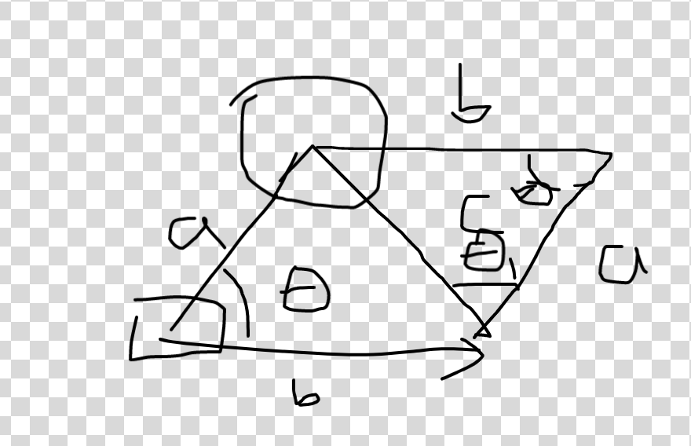

# Shooting While Moving

## Why?

It's cool and the robot doesn't need to stop to shoot saving time!

## How?

Idk, this probably won't work in reality.

The way this method works though is it creates a parallelogram like below.



In this badly drawn image, $a$ is the distance to the target, $b$ is the distance
the robot will travel in the flight time of the ball (needs to be known for this)
$theta$ is the angle of the turret.

The code will then calculate $c$ and $theta_1$ using basic trig.

The code also requires having a method to calculate flywheel speeds for each given distance.

Using the given algorithm (best way is probably an interpolating tree map with predetermined values),
you would then find the flywheel speeds for $c$ and change the turret angle by adding $theta_1$.

Hopefully this works in reality :pray:

## Simulation

The code provided is a badly written :vomit: simulation code written in Rust using the 
[Bevy library](https://bevyengine.org/).
To run it, make sure to have `cargo` installed and all the dependencies `bevy` needs.

To run use:
```shell
cargo run
```

## Troubleshooting

1. Bevy crashes immediately on Linux

Make sure to have Vulkan drivers installed, that's what caused this for me at least!